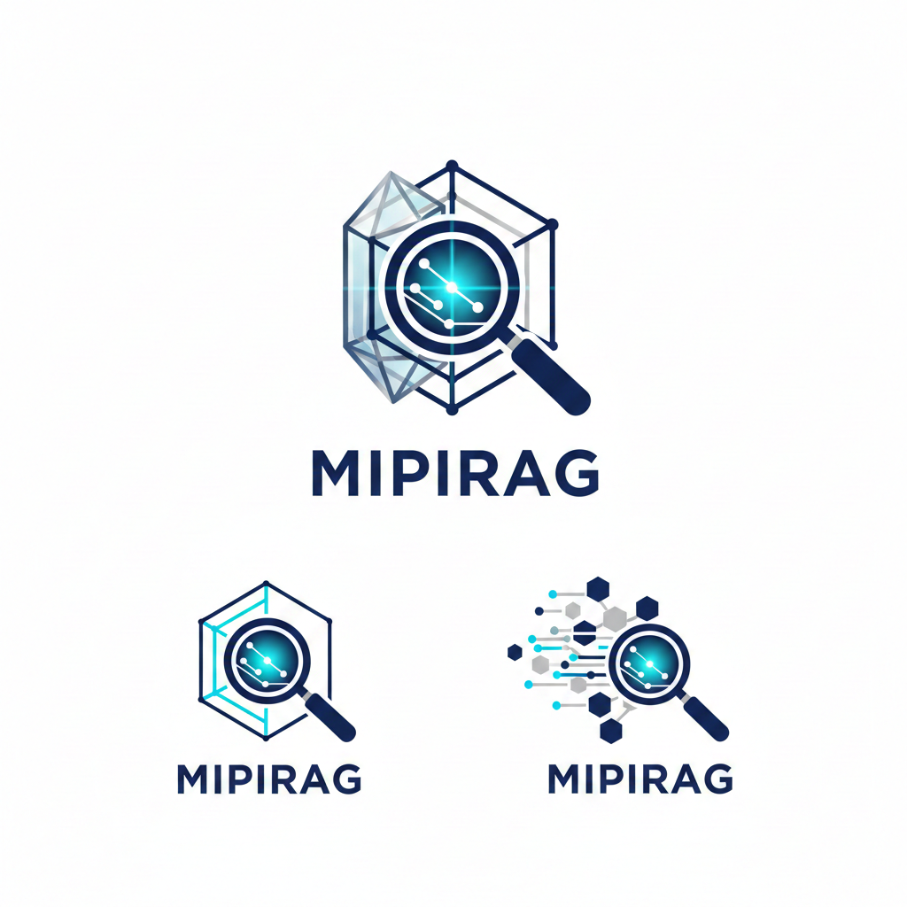
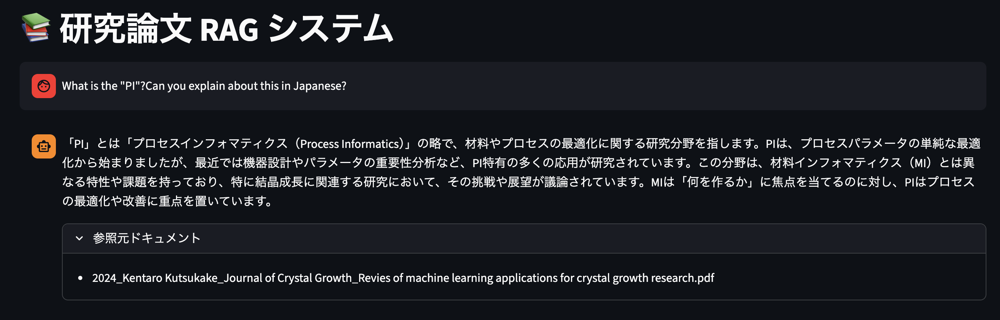
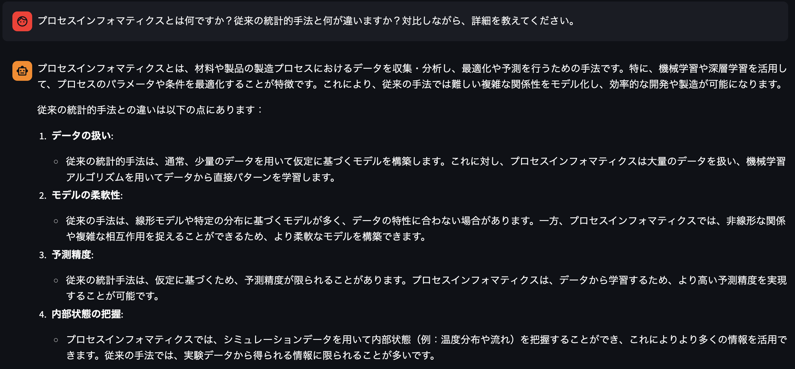

# 🎯 MIPIRAG(Materials Informatics & Process Intelligence RAG) - MIやPIに関する論文RAG（LLM × Streamlit）：第1弾

"Accelerating Material Discovery through Agentic Intelligence"

MIPIRAGは、マテリアルズ・インフォマティクス（MI）およびプロセス・インテリジェンス（PI）に特化した、高度なAdaptive RAG（検索拡張生成）システムです。膨大な研究論文や製造プロセスデータから、AIエージェントが自律的に情報を取捨選択し、根拠に基づいた洞察を提供します。（事前に作ったベクトルストアの元、返答する仕組みです。）

🚀 Key Features
Adaptive Retrieval: LangGraphによる自律的なワークフロー制御。検索結果が不十分な場合、クエリを自動的に再構成（Query Transformation）して再検索を実行します。

Precision Engineering: 論文特有の複雑な数式や巨大なテーブルを含むPDFを、トークンベースの物理スライス技術により、OpenAIの制限を回避しつつ正確にベクトル化。

Source Transparency: 回答のすべての根拠をメタデータから追跡可能。信頼性を最優先する研究開発現場に最適です。

🛠️ Tech Stack
Core: Python 3.13 / LangChain v0.3 / LangGraph
Database: FAISS (Facebook AI Similarity Search)
LLM: OpenAI GPT-4o-mini / text-embedding-3-small
Interface: Streamlit

## 🖼️ アプリ画面

①システムイメージ

## ✨ 作者

**Ta9se1E**（[note](https://note.com/ta9se1)｜[GitHub](https://github.com/ta9se1E)）  
AI × アプリ開発に取り組む研究者・エンジニア。  
