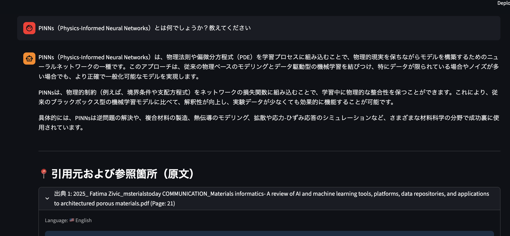
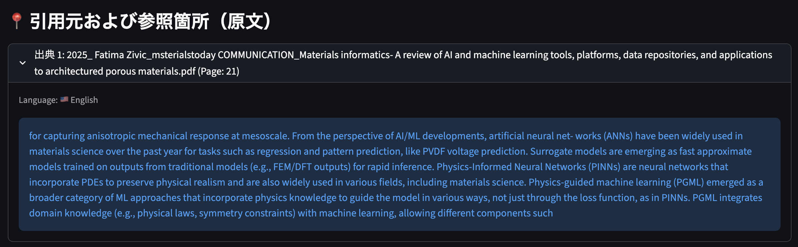
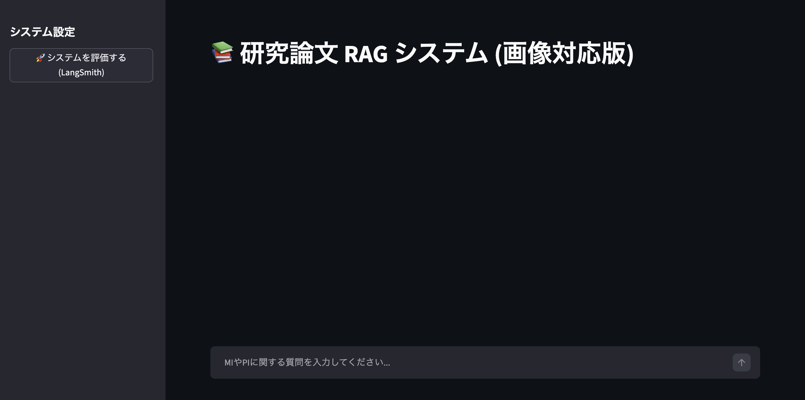
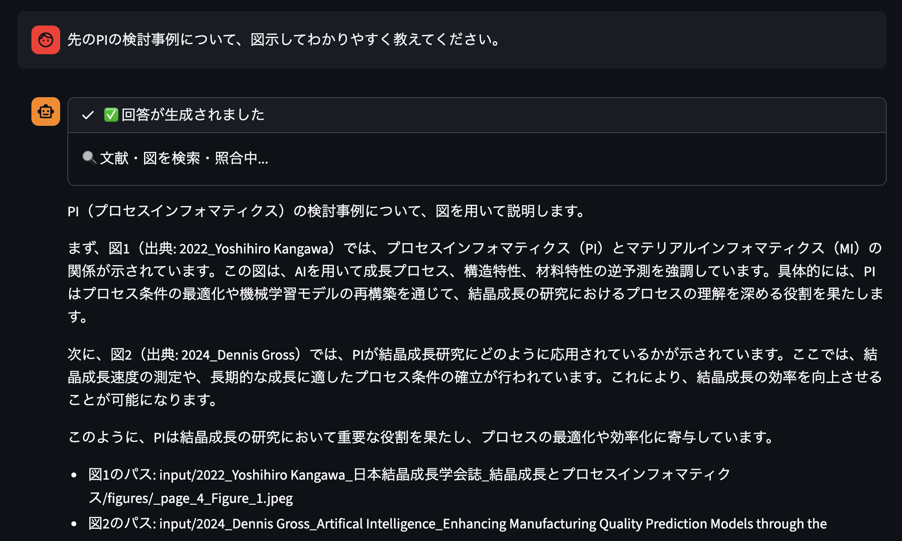
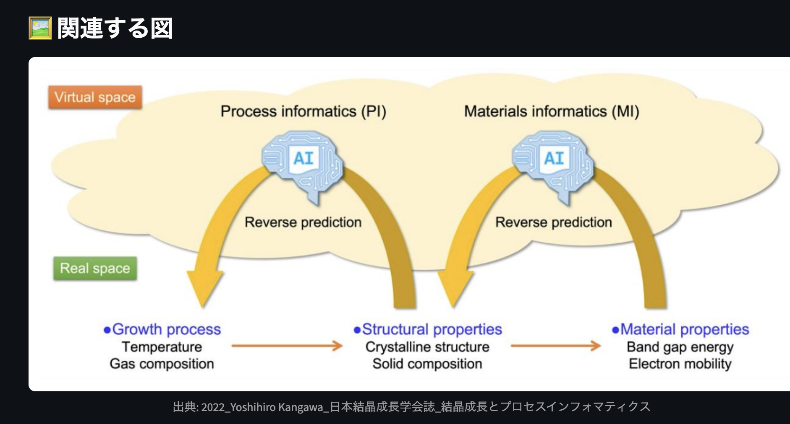
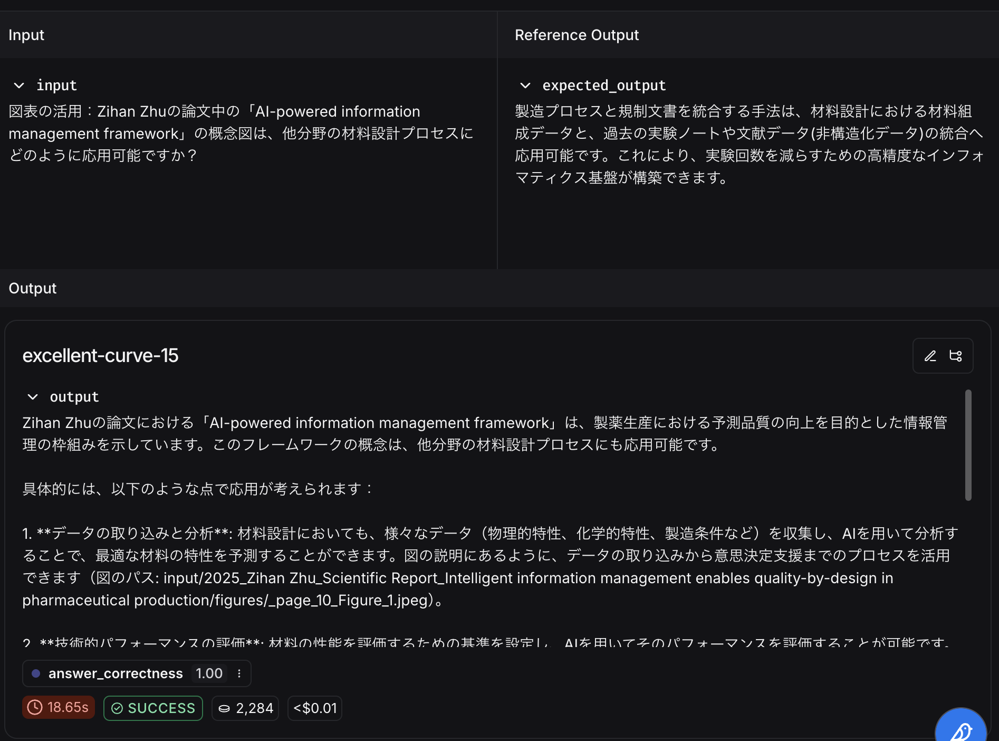

# 🎯 MIPIRAG(Materials Informatics & Process Intelligence RAG) - MIやPIに関する論文RAG（LLM × Streamlit）：第1弾

"Accelerating Material Discovery through Agentic Intelligence"

概要
MIPIRAGは、マテリアルズ・インフォマティクス（MI）およびプロセス・インテリジェンス（PI）研究に特化した、マルチモーダルなAdaptive RAG（検索拡張生成）システムです。膨大な研究論文からテキスト情報だけでなく、複雑な図表（Figure）の内容も自律的に解析・検索し、科学的根拠に基づいた洞察を可視化します。

🚀 Key Features
Multimodal Adaptive Retrieval: LangGraphによる自律的ワークフローに加え、論文中の図表（Figures）をベクトル化して検索対象に統合。関連する図を回答と同時に表示し、研究者の理解を直感的にサポートします。

LLM-Powered Figure Analysis: gpt-4o-mini を活用し、PDFから抽出された未定義の図表に対して動的にコンテキストを生成。画像の内容をテキスト化することで、高精度な意味検索を実現しました。

Adaptive Query Transformation: 検索結果の精度が不十分な場合、LangGraphがクエリを自動的に再構成（Query Transformation）し、研究の核心に迫るまで自律的に再検索を実行します。

Integrated Evaluation Framework: LangSmithを活用した自動評価パイプラインを実装。回答の正確性を定量的に測定し、システム構成の改善サイクルを高速化します。

Source & Visual Transparency: 回答の根拠となる原文テキストだけでなく、参照した図表の出所をメタデータから追跡可能。信頼性を最優先する研究開発現場の意思決定を支援します。

🛠️ Tech Stack
Core: Python 3.13 / LangChain v0.3 / LangGraph

Multimodal Processing: OpenAI GPT-4o-mini (Vision API)

Database: FAISS (Facebook AI Similarity Search)

Evaluation: LangSmith (Automated RAG evaluation)

Interface: Streamlit (Dynamic Image Rendering)

💡 評価システムの活用について
本システムには、LangSmithを用いた評価モジュールが統合されています。evaluate_rag_system 関数を使用することで、あらかじめ用意したテストデータセット（RAG_MIPI）に対して回答の正確性を自動評価し、開発したRAGパイプラインの品質を継続的にモニタリング可能です。

## 🖼️ アプリ画面

①システムイメージ

## ✨ 作者

**Ta9se1E**（[note](https://note.com/ta9se1)｜[GitHub](https://github.com/ta9se1E)）  
AI × アプリ開発に取り組む研究者・エンジニア。  
